<p align="center">
  
</p>

<h1 align="center">Tool Borrow</h1>

<p align="center">
  <strong>Odoo 18 Community Module for Internal Tool & Device Lending Management</strong><br/>
  Full lifecycle tracking from request to return, with role-based access and portal self-service.
</p>

<p align="center">
  <a href="#features">Features</a> &bull;
  <a href="#architecture">Architecture</a> &bull;
  <a href="#screenshots">Screenshots</a> &bull;
  <a href="#installation">Installation</a> &bull;
  <a href="#configuration">Configuration</a> &bull;
  <a href="#security">Security</a> &bull;
  <a href="#testing">Testing</a> &bull;
  <a href="README_zh_TW.md">中文文件</a>
</p>

<p align="center">
  
  
  
  
  
</p>

---

## Overview

**Tool Borrow** is a standalone Odoo 18 Community module that lets organizations manage shared tools and devices through a structured borrow-and-return workflow. Managers approve or reject loan requests; the system tracks availability automatically; portal users can browse and request tools without backend access.

| Challenge | Solution |
|-----------|----------|
| Tools disappear without records | Every tool gets a unique auto-generated code (`TL-001`, `TL-002`, …) and full loan history |
| No approval process for lending | Multi-step workflow: Draft → Pending → Approved → Borrowed → Returned (or Rejected) |
| Managers lack visibility | Category-based organization with kanban dashboards showing tool and loan counts |
| Portal users can't self-serve | Branded portal pages let users browse tools and submit borrow requests directly |
| Access control is all-or-nothing | Granular 2-tier permission model: Internal Users (read-only) vs Equipment Managers (full control) |

---

## Features

### Tool Management
- **Auto-generated codes** — Sequential tool codes (`TL-001`, `TL-002`, …) via `ir.sequence`
- **Stage-based tracking** — Configurable stages with color coding (default: In Service, Under Maintenance, Retired)
- **Availability state** — Computed state: Available, Unavailable, Under Maintenance
- **One-click status toggle** — "Set to Maintenance" / "Set to Available" buttons on form view
- **Category organization** — Group tools by category with kanban and list views
- **Dynamic properties** — Per-category custom fields via `PropertiesDefinition`
- **Portal user assignment** — Control which portal users can see and borrow each tool

### Loan Workflow
- **Full lifecycle** — Draft → Pending → Approved → Borrowed → Returned (or Rejected)
- **Manager approval** — Equipment Managers approve or reject pending requests
- **Auto-availability** — Tool state updates automatically on borrow and return
- **Loan history** — Complete audit trail embedded in the tool form view
- **Chatter integration** — All status changes tracked via `mail.thread`

### Portal Self-Service
- **Equipment hub** — Branded portal page with "Equipment Tools" and "My Loans" cards
- **Tool browsing** — Portal users can view tools assigned to them
- **Borrow requests** — Submit loan requests directly from the portal
- **Loan tracking** — View loan status and history from the portal

### Access Control
- **Internal Users** — Read-only access to all tools; can create and manage own loan requests
- **Equipment Managers** — Full CRUD on tools, categories, stages; approve/reject loans
- **Portal Users** — Browse assigned tools and manage own borrow requests via portal
- **Backend restriction** — Non-manager users cannot access backend menus via direct URL

---

## Architecture

### Module Dependency Graph

```
┌─────────────────────────────────────────────────────┐
│                    tool_borrow                       │
│                                                      │
│  ┌─────────────┐  ┌──────────────┐  ┌─────────────┐ │
│  │ tool.stage   │  │tool.category │  │  tool.tool   │ │
│  │  (stages)    │  │  (grouping)  │  │  (assets)   │ │
│  └──────┬──────┘  └──────┬───────┘  └──────┬──────┘ │
│         │                │                  │        │
│         └────────────────┼──────────────────┘        │
│                          │                            │
│                   ┌──────┴───────┐                    │
│                   │  tool.loan    │                    │
│                   │  (workflow)   │                    │
│                   └──────────────┘                    │
└──────────────────────┬────────────────────────────────┘
                       │ depends
           ┌───────────┼───────────┐
           ▼           ▼           ▼
        [base]      [mail]     [portal]
```

### Data Model

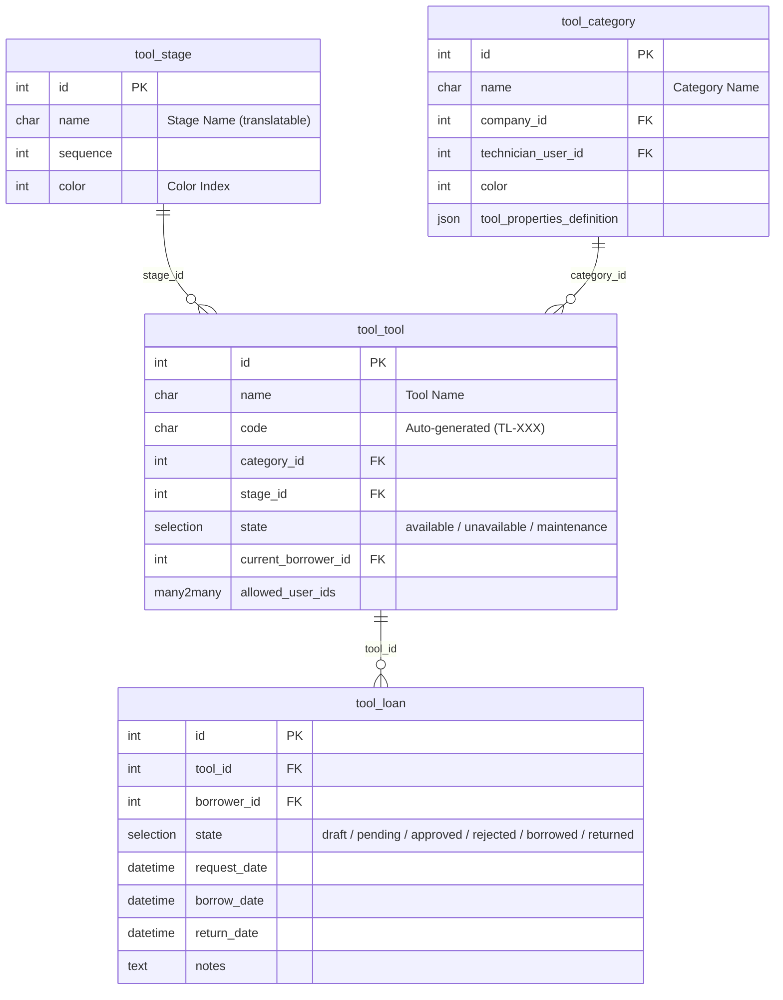

### Loan State Machine

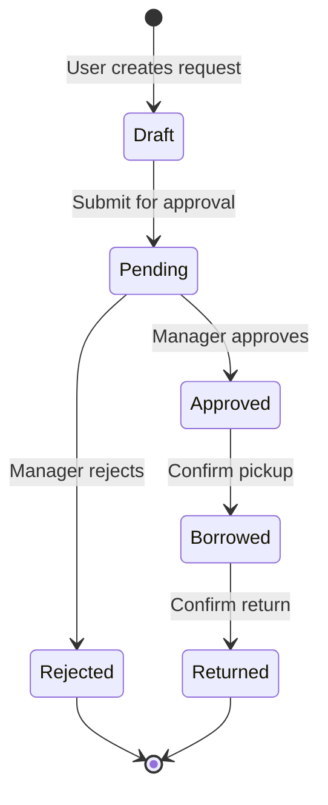

### Request-Response Flow

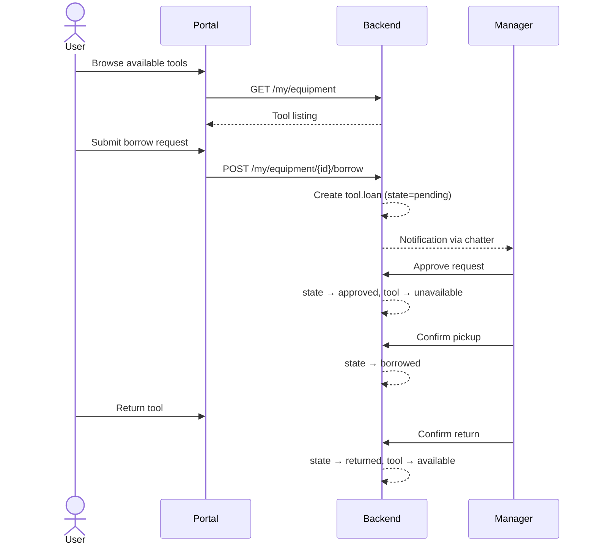

### Directory Structure

```
tool_borrow/
├── __init__.py                  # Module init + post_init_hook
├── __manifest__.py              # v18.0.1.3.0, depends: base, mail, portal
├── controllers/
│   ├── action.py                # Backend action access control
│   └── portal.py                # Portal routes (/my/equipment, /my/loans)
├── data/
│   ├── tool_category_data.xml   # Default categories
│   ├── tool_sequence_data.xml   # Auto-code sequence (TL-XXX)
│   └── tool_stage_data.xml      # Default stages
├── i18n/
│   └── zh_TW.po                 # Traditional Chinese translations
├── migrations/
│   ├── 18.0.1.1.0/
│   └── 18.0.1.2.0/
├── models/
│   ├── ir_http.py               # Portal URL rules
│   ├── res_users.py             # tool_borrow_access field on users
│   ├── tool_loan.py             # Loan request model + workflow
│   └── tool_tool.py             # Stage, Category, Tool models
├── security/
│   ├── ir.model.access.csv      # ACL rules
│   └── tool_borrow_security.xml # Groups + record rules
├── static/
│   ├── description/
│   │   └── icon.png             # Module icon (orange wrench)
│   └── src/
│       ├── css/portal_brand.css # Portal styling
│       └── img/                 # SVG icons for portal
├── tests/                       # 5 test suites
│   ├── test_round1_models.py
│   ├── test_round2_security.py
│   ├── test_round3_http.py
│   ├── test_round4_browser.py
│   └── test_round5_supplementary.py
└── views/
    ├── menu_views.xml           # App menu structure
    ├── portal_templates.xml     # Portal pages
    ├── res_users_views.xml      # User form extension
    ├── tool_loan_views.xml      # Loan views
    └── tool_tool_views.xml      # Tool/Category/Stage views
```

---

## Screenshots

### Backend — Tool List View

Tool inventory with auto-generated codes, stage badges, and portal user assignments. The toolbar provides access to Tools, Borrow Requests, My Loans, and Settings menus.

<p align="center">
  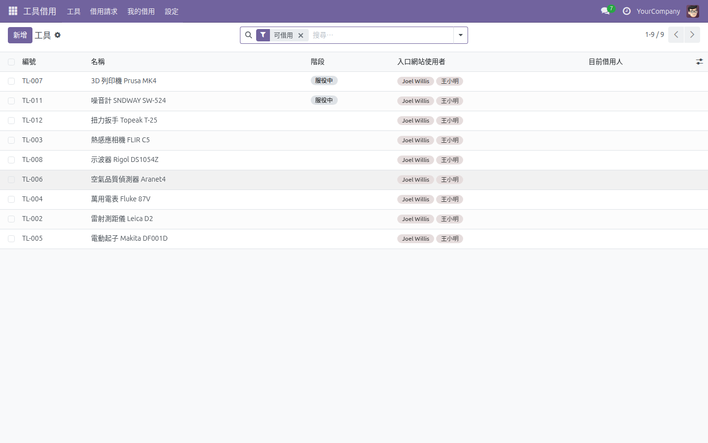
</p>

### Backend — Tool Form View

Detailed tool form showing service status, borrow state, category, portal user assignment, and embedded loan history with chatter. The "Set to Maintenance" button toggles the tool's service status.

<p align="center">
  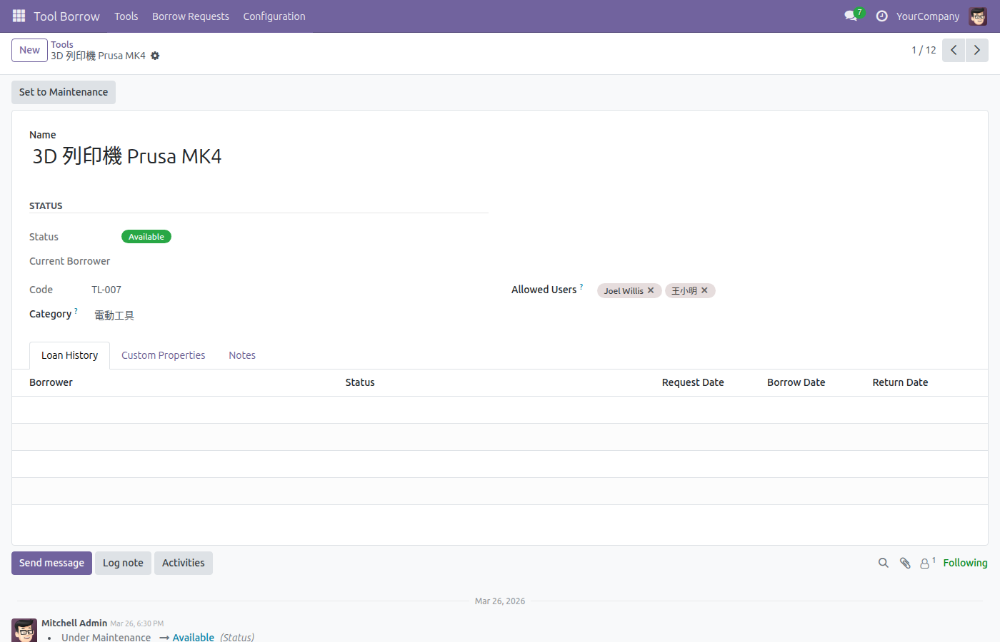
</p>

### Backend — Category Kanban

Category dashboard with kanban cards showing tool count (wrench icon) and active loan count (handshake icon) per category.

<p align="center">
  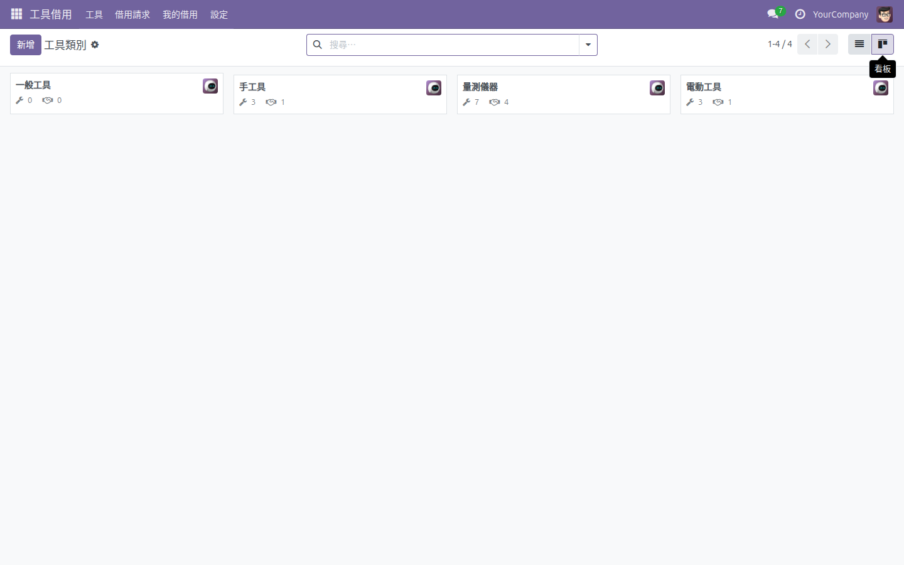
</p>

### Backend — Category Form

Category detail with two smart buttons (Tools and Loans) for quick navigation. Includes responsible person, color selection, and notes.

<p align="center">
  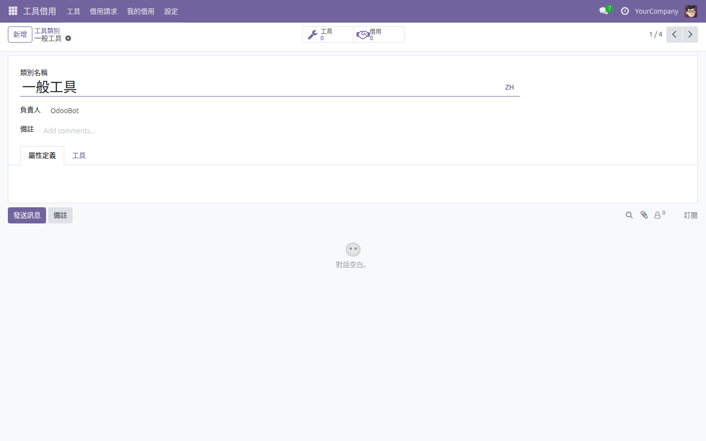
</p>

### Backend — Stage Configuration

Stage management with name and color fields. Default stages: In Service (服役中), Under Maintenance (維護中), Retired (已退役).

<p align="center">
  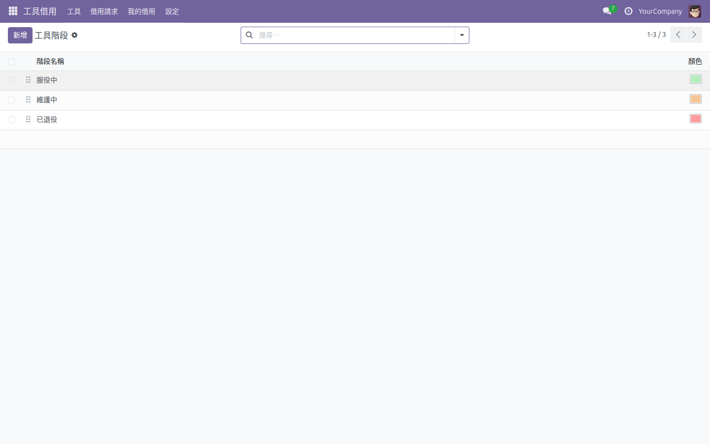
</p>

### Backend — Loan Request List

All borrow requests with color-coded state badges (Pending / Approved / Borrowed / Returned / Rejected), borrower info, and date tracking.

<p align="center">
  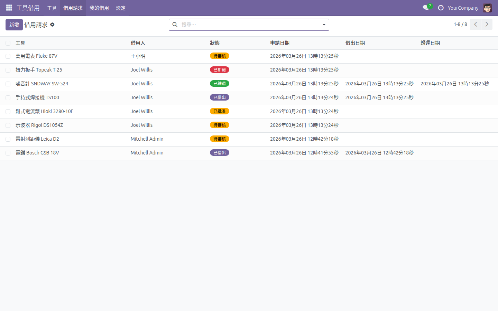
</p>

### Backend — Loan Form

Loan request detail with approval/rejection workflow buttons, tool information, borrower, dates, and notes.

<p align="center">
  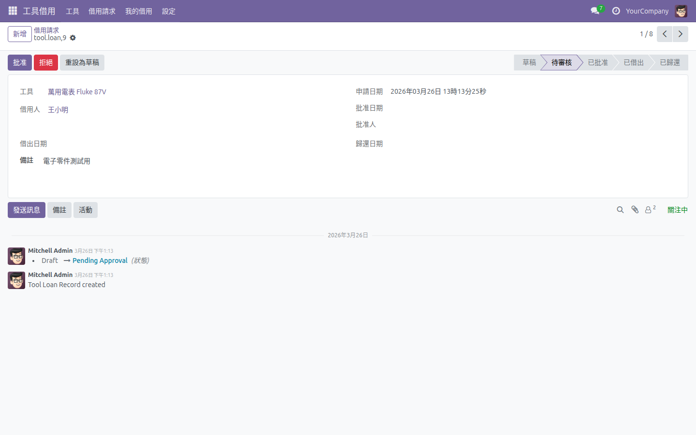
</p>

### Backend — User Access Control

Per-user tool borrow access configuration via the `tool_borrow_access` selection field on the user form.

<p align="center">
  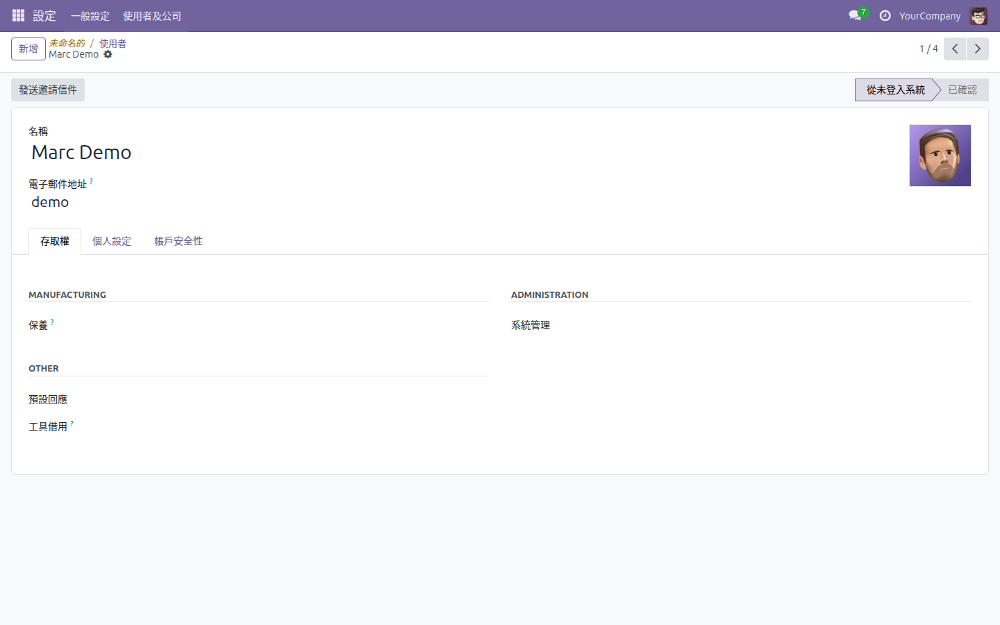
</p>

### Portal — My Account Home

Portal users see "Tools" and "My Loans" cards on their account page, providing self-service access to equipment borrowing.

<p align="center">
  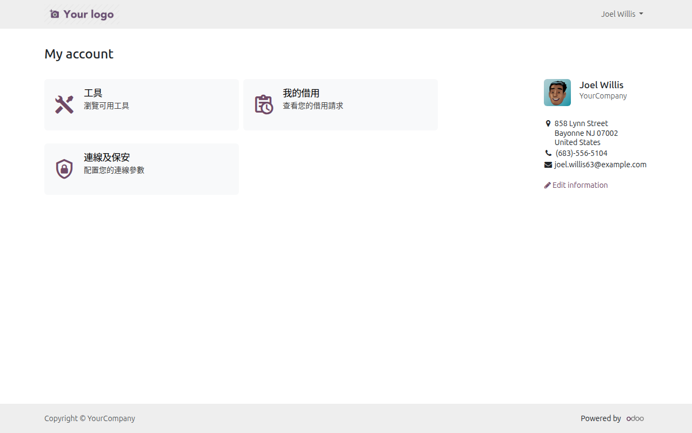
</p>

### Portal — Equipment Listing

Portal tool catalog showing available tools with category, status, and detail links.

<p align="center">
  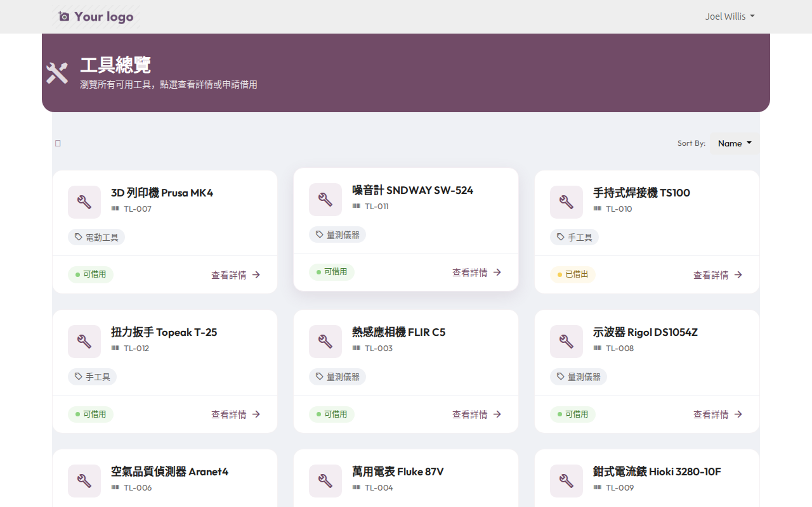
</p>

### Portal — Tool Detail

Individual tool detail page in the portal with specifications and borrow request functionality.

<p align="center">
  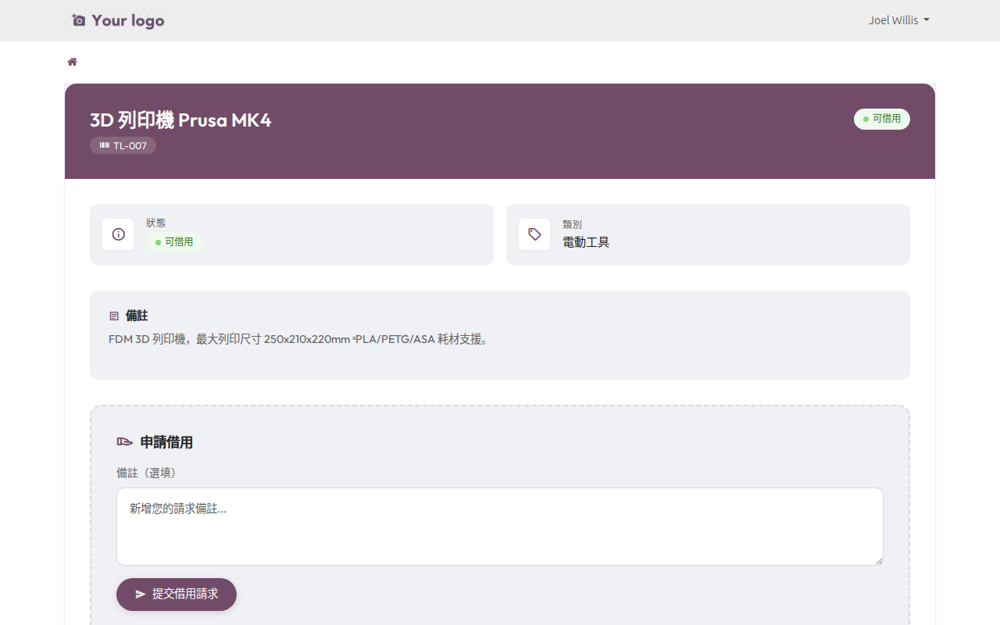
</p>

### Portal — My Loans

Portal loan history showing all borrow requests and their current status.

<p align="center">
  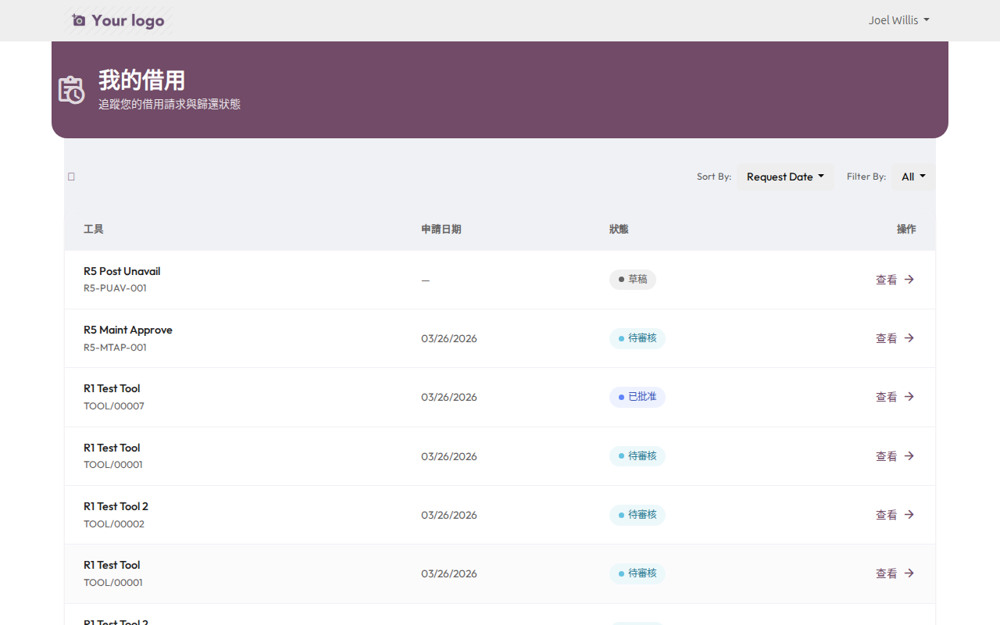
</p>

### Portal — Loan Detail

Individual loan detail page showing status, dates, tool information, and notes.

<p align="center">
  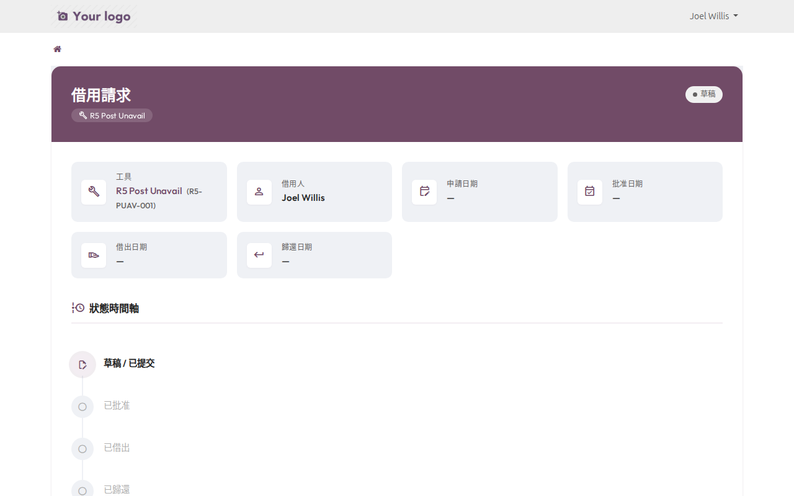
</p>

---

## Installation

### Prerequisites

- Odoo 18.0 Community or Enterprise
- Python 3.10+
- PostgreSQL 14+

### Step 1: Deploy Module

Copy the `tool_borrow/` directory to your Odoo addons path:

```bash
cp -r tool_borrow /path/to/odoo/addons/
```

Or using Docker/Podman, mount as an extra addon:

```bash
podman run -d \
  -v ./tool_borrow:/mnt/extra-addons/tool_borrow:ro \
  -e EXTRA_ADDONS=/mnt/extra-addons \
  odoo:18
```

### Step 2: Update Apps List

In Odoo, go to **Apps** → **Update Apps List** → search for "Tool Borrow" → click **Install**.

### Step 3: Verify Installation

After installation, the **Tool Borrow** app (wrench icon) appears in the main menu. The post-install hook automatically:

- Sets backend menu visibility to Equipment Managers only
- Assigns the admin user as Tool Borrow Admin

---

## Configuration

### 1. Stages

Navigate to **Tool Borrow → Settings → Stages** to manage tool lifecycle stages. Three defaults are created on install:

| Stage | Color | Description |
|-------|-------|-------------|
| In Service (服役中) | Green | Tool is operational and available for borrowing |
| Under Maintenance (維護中) | Orange | Tool is temporarily out of service |
| Retired (已退役) | Red | Tool is permanently decommissioned |

### 2. Categories

Navigate to **Tool Borrow → Settings → Categories** to organize tools by type. Each category supports:

- **Responsible** person (default technician)
- **Custom properties** — Dynamic fields applied to all tools in the category
- **Color** for kanban card display

### 3. User Access

Navigate to **Settings → Users** and set the **Tool Borrow Access** field:

| Level | Backend Access | Portal Access | Description |
|-------|---------------|---------------|-------------|
| *(blank)* | None | None | No access to Tool Borrow features |
| User | Read-only tools, manage own loans | — | Standard internal user |
| Manager | Full CRUD, approve/reject loans | — | Equipment manager |
| Admin | Full CRUD + stage/category config | — | System administrator |
| Portal | — | Browse tools, submit requests | External portal user |

### 4. Portal Users

On each tool's form view, assign portal users in the **Portal Users** field. Only assigned portal users can see and request that tool from the portal.

---

## Security

### Permission Model

```
┌──────────────────────────────────────────────────────────────┐
│                     tool_borrow Access                        │
├───────────────────┬──────────────────────────────────────────┤
│  Portal Users     │  Browse assigned tools, submit requests  │
│  (group_portal)   │  Read-only tools, own loans only         │
├───────────────────┼──────────────────────────────────────────┤
│  Internal Users   │  Read-only all tools                     │
│  (group_user)     │  CRUD own loan requests                  │
├───────────────────┼──────────────────────────────────────────┤
│  Equipment Mgr    │  Full CRUD: tools, categories, loans     │
│ (group_tool_mgr)  │  Approve/reject any loan request         │
├───────────────────┼──────────────────────────────────────────┤
│  Admin            │  Everything above + stage config         │
│ (group_tool_adm)  │  + user access level management          │
└───────────────────┴──────────────────────────────────────────┘
```

### Security Features

- **Record rules** enforce row-level access per model
- **Backend menu restriction** — Non-manager users cannot see Tool Borrow menus
- **Action-level guards** — Direct URL access to backend actions is blocked for unauthorized users via `controllers/action.py`
- **Portal isolation** — Portal users can only read tools and manage their own loans
- **Post-install hook** hardens default permissions after module installation

---

## Testing

The module includes 5 comprehensive test suites:

| Suite | File | Focus |
|-------|------|-------|
| Round 1 | `test_round1_models.py` | Model CRUD, constraints, computed fields |
| Round 2 | `test_round2_security.py` | Permission rules, group-based access |
| Round 3 | `test_round3_http.py` | Portal HTTP endpoints, access control |
| Round 4 | `test_round4_browser.py` | Browser-based UI integration tests |
| Round 5 | `test_round5_supplementary.py` | Edge cases, data integrity |

### Playwright UI Tests

7 Playwright browser tests verify the UI after recent changes:

| # | Test | Result |
|---|------|--------|
| 1 | Stage list view shows only name + color columns | Pass |
| 2 | Stage CRUD — inline create with name + color | Pass |
| 3 | Category form — exactly 2 smart buttons (Tools + Loans) | Pass |
| 4 | Category kanban — wrench + handshake icons, no cog | Pass |
| 5 | Tool maintenance/available toggle buttons | Pass |
| 6 | Module icon loads correctly (PNG, 2125 bytes) | Pass |
| 7 | Stage form has no is_closed/fold fields, 3 stages | Pass |

---

## Changelog

### v1.3.0 (2026-05)

- Simplified `tool.stage` — removed `is_closed` and `fold` fields
- Removed maintenance tracking from `tool.category`
- New transparent-background module icon (round orange wrench)
- Redesigned `tool.category` to mirror `maintenance.equipment.category`
- Added color picker to tool stages
- Rewrote test suites for stage-based architecture
- Added Playwright UI test suite (7/7 passing)

### v1.2.0 (2026-04)

- 2-tier permission redesign (User → Manager hierarchy)
- Portal Equipment Borrowing hub with breadcrumb navigation
- Dynamic brand color integration
- Complete Traditional Chinese (zh_TW) translations (144 strings)

### v1.1.0 (2026-03)

- Auto-generated tool codes via `ir.sequence`
- Category-based tool organization with kanban views
- Loan request workflow with approval states
- Portal self-service for tool browsing and borrow requests
- Role-based access control

### v1.0.0 (2026-03)

- Initial release — basic tool and loan management

---

## Support

- **Author:** [WoowTech](https://www.woowtech.com)
- **Issues:** [GitHub Issues](https://github.com/WOOWTECH/Odoo_tool-device_borrow/issues)
- **Repository:** [github.com/WOOWTECH/Odoo_tool-device_borrow](https://github.com/WOOWTECH/Odoo_tool-device_borrow)

---

## License

This module is licensed under the [LGPL-3](https://www.gnu.org/licenses/lgpl-3.0.html) license.

---

<p align="center">
  <sub>Built with &#10084; by <a href="https://www.woowtech.com">WOOWTECH</a></sub>
</p>
