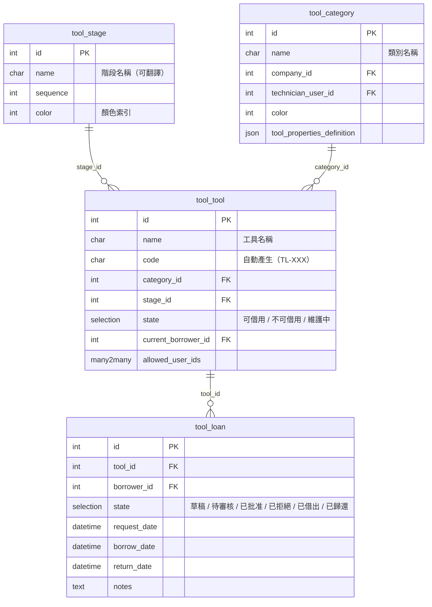
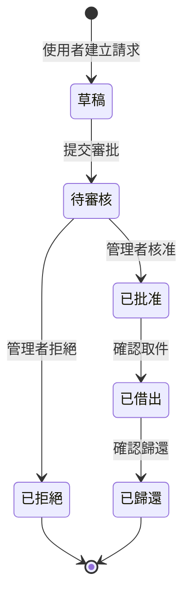
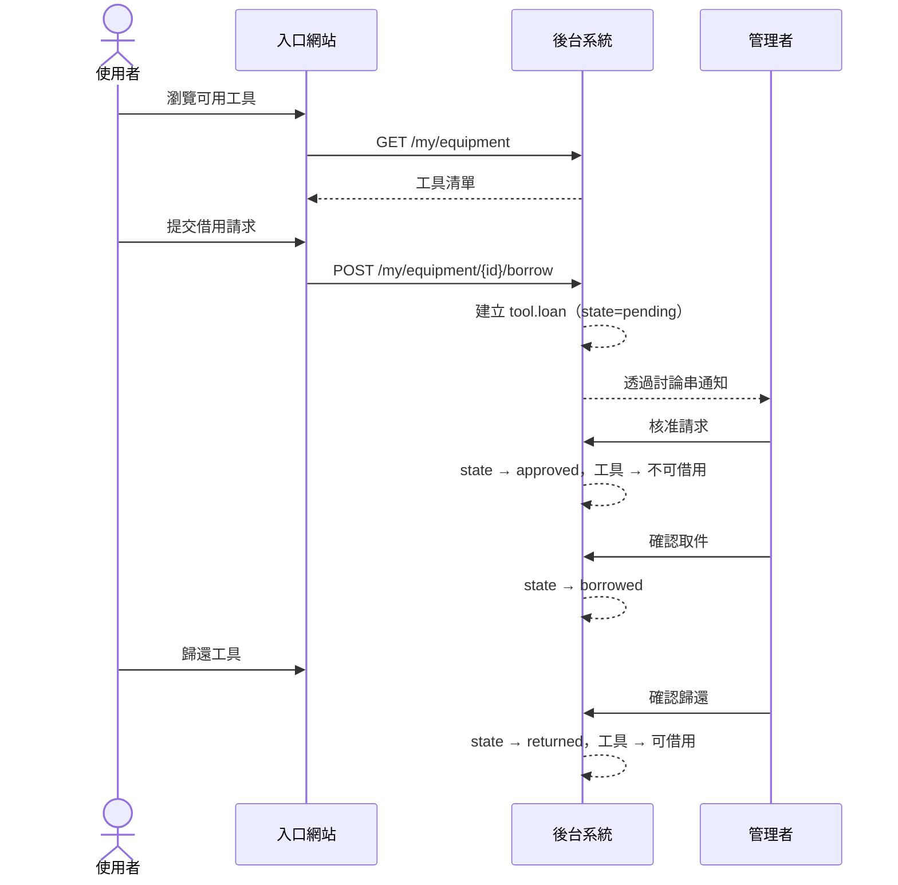

<p align="center">
  
</p>

<h1 align="center">工具借用 Tool Borrow</h1>

<p align="center">
  <strong>Odoo 18 社群版模組 — 內部工具與設備借用管理系統</strong><br/>
  從申請到歸還的完整生命週期追蹤，搭配角色權限控管與入口網站自助服務。
</p>

<p align="center">
  <a href="#功能特色">功能特色</a> &bull;
  <a href="#系統架構">系統架構</a> &bull;
  <a href="#系統截圖">系統截圖</a> &bull;
  <a href="#安裝方式">安裝方式</a> &bull;
  <a href="#系統設定">系統設定</a> &bull;
  <a href="#權限控管">權限控管</a> &bull;
  <a href="#測試">測試</a> &bull;
  <a href="README.md">English</a>
</p>

<p align="center">
  
  
  
  
  
</p>

---

## 概述

**工具借用（Tool Borrow）** 是一套獨立的 Odoo 18 社群版模組，讓組織透過結構化的借還流程來管理共用工具與設備。管理者審核借用請求；系統自動追蹤可用狀態；入口網站使用者無需存取後台即可瀏覽與申請工具。

| 問題 | 解決方案 |
|------|----------|
| 工具借出後無紀錄可查 | 每件工具自動生成唯一編號（`TL-001`、`TL-002`、…），並保留完整借用歷史 |
| 借用缺乏審批流程 | 多階段工作流程：草稿 → 待審核 → 已批准 → 已借出 → 已歸還（或已拒絕） |
| 管理者缺乏整體掌握度 | 依類別組織，看板儀表板顯示各類別工具數量與借用數量 |
| 入口網站使用者無法自助操作 | 品牌化入口頁面，使用者可直接瀏覽工具並提交借用請求 |
| 權限控管過於粗糙 | 精細的二層權限模型：一般使用者（唯讀）vs 設備管理者（完整控制） |

---

## 功能特色

### 工具管理
- **自動編號** — 透過 `ir.sequence` 自動產生流水編號（`TL-001`、`TL-002`、…）
- **階段式追蹤** — 可自訂階段搭配顏色標示（預設：服役中、維護中、已退役）
- **可用狀態** — 自動計算狀態：可借用、不可借用、維護中
- **一鍵切換狀態** — 表單上的「設為維護中」/「設為可借用」按鈕
- **類別管理** — 依類別分組，支援看板與列表檢視
- **動態屬性** — 透過 `PropertiesDefinition` 為各類別定義自訂欄位
- **入口使用者指派** — 控制哪些入口使用者可以查看與借用各工具

### 借用流程
- **完整生命週期** — 草稿 → 待審核 → 已批准 → 已借出 → 已歸還（或已拒絕）
- **管理者審批** — 設備管理者審核或拒絕待審請求
- **自動更新狀態** — 借出與歸還時自動更新工具可用狀態
- **借用歷史** — 完整的稽核軌跡嵌入在工具表單中
- **討論串整合** — 所有狀態變更透過 `mail.thread` 追蹤

### 入口網站自助服務
- **設備中心** — 品牌化入口頁面，包含「設備工具」與「我的借用」卡片
- **工具瀏覽** — 入口使用者可查看已指派的工具
- **借用申請** — 直接從入口網站提交借用請求
- **借用追蹤** — 從入口網站查看借用狀態與歷史

### 存取控制
- **一般使用者** — 唯讀存取所有工具；可建立與管理自己的借用請求
- **設備管理者** — 工具、類別、階段完整 CRUD；審核/拒絕借用
- **入口使用者** — 透過入口網站瀏覽指定工具與管理自己的借用請求
- **後台限制** — 非管理者使用者無法透過直接 URL 存取後台選單

---

## 系統架構

### 模組相依圖

```
┌─────────────────────────────────────────────────────┐
│                    tool_borrow                       │
│                                                      │
│  ┌─────────────┐  ┌──────────────┐  ┌─────────────┐ │
│  │ tool.stage   │  │tool.category │  │  tool.tool   │ │
│  │   (階段)     │  │   (類別)     │  │   (工具)    │ │
│  └──────┬──────┘  └──────┬───────┘  └──────┬──────┘ │
│         │                │                  │        │
│         └────────────────┼──────────────────┘        │
│                          │                            │
│                   ┌──────┴───────┐                    │
│                   │  tool.loan    │                    │
│                   │   (借用)      │                    │
│                   └──────────────┘                    │
└──────────────────────┬────────────────────────────────┘
                       │ 相依
           ┌───────────┼───────────┐
           ▼           ▼           ▼
        [base]      [mail]     [portal]
```

### 資料模型



### 借用狀態機



### 請求回應流程



### 目錄結構

```
tool_borrow/
├── __init__.py                  # 模組初始化 + post_init_hook
├── __manifest__.py              # v18.0.1.3.0，相依：base、mail、portal
├── controllers/
│   ├── action.py                # 後台動作存取控制
│   └── portal.py                # 入口路由（/my/equipment、/my/loans）
├── data/
│   ├── tool_category_data.xml   # 預設類別
│   ├── tool_sequence_data.xml   # 自動編號序列（TL-XXX）
│   └── tool_stage_data.xml      # 預設階段
├── i18n/
│   └── zh_TW.po                 # 繁體中文翻譯
├── migrations/
│   ├── 18.0.1.1.0/
│   └── 18.0.1.2.0/
├── models/
│   ├── ir_http.py               # 入口 URL 規則
│   ├── res_users.py             # 使用者 tool_borrow_access 欄位
│   ├── tool_loan.py             # 借用請求模型 + 流程
│   └── tool_tool.py             # 階段、類別、工具模型
├── security/
│   ├── ir.model.access.csv      # ACL 規則
│   └── tool_borrow_security.xml # 群組 + 記錄規則
├── static/
│   ├── description/
│   │   └── icon.png             # 模組圖示（橘色扳手）
│   └── src/
│       ├── css/portal_brand.css # 入口樣式
│       └── img/                 # 入口 SVG 圖示
├── tests/                       # 5 套測試
│   ├── test_round1_models.py
│   ├── test_round2_security.py
│   ├── test_round3_http.py
│   ├── test_round4_browser.py
│   └── test_round5_supplementary.py
└── views/
    ├── menu_views.xml           # 應用程式選單
    ├── portal_templates.xml     # 入口頁面
    ├── res_users_views.xml      # 使用者表單擴充
    ├── tool_loan_views.xml      # 借用檢視
    └── tool_tool_views.xml      # 工具/類別/階段檢視
```

---

## 系統截圖

### 後台 — 工具列表

工具清單顯示自動編號、階段徽章、入口使用者指派。工具列提供工具、借用請求、我的借用、設定等選單。

<p align="center">
  
</p>

### 後台 — 工具表單

詳細的工具表單，顯示服役狀態、借用狀態、類別、入口使用者指派，以及嵌入式借用歷史與討論串。「設為維護中」按鈕可切換工具的服役狀態。

<p align="center">
  
</p>

### 後台 — 類別看板

類別儀表板以看板卡片顯示各類別的工具數量（扳手圖示）與進行中借用數量（握手圖示）。

<p align="center">
  
</p>

### 後台 — 類別表單

類別詳情頁，包含兩個智慧按鈕（工具與借用）可快速導覽。包含負責人員、顏色選擇與備註。

<p align="center">
  
</p>

### 後台 — 階段設定

階段管理，提供名稱與顏色欄位。預設階段：服役中、維護中、已退役。

<p align="center">
  
</p>

### 後台 — 借用請求列表

所有借用請求，以顏色標示狀態徽章（待審核/已批准/已借出/已歸還/已拒絕），包含借用人資訊與日期追蹤。

<p align="center">
  
</p>

### 後台 — 借用表單

借用請求詳情，包含審批/拒絕工作流程按鈕、工具資訊、借用人、日期與備註。

<p align="center">
  
</p>

### 後台 — 使用者權限設定

透過使用者表單上的 `tool_borrow_access` 選擇欄位，為每位使用者設定工具借用存取等級。

<p align="center">
  
</p>

### 入口 — 我的帳戶首頁

入口使用者在帳戶頁面看到「工具」與「我的借用」卡片，提供設備借用的自助存取。

<p align="center">
  
</p>

### 入口 — 設備清單

入口工具目錄，顯示可用工具的類別、狀態與詳情連結。

<p align="center">
  
</p>

### 入口 — 工具詳情

入口網站中的個別工具詳情頁，包含規格與借用請求功能。

<p align="center">
  
</p>

### 入口 — 我的借用

入口借用歷史，顯示所有借用請求及其目前狀態。

<p align="center">
  
</p>

### 入口 — 借用詳情

個別借用詳情頁，顯示狀態、日期、工具資訊與備註。

<p align="center">
  
</p>

---

## 安裝方式

### 前置需求

- Odoo 18.0 社群版或企業版
- Python 3.10+
- PostgreSQL 14+

### 步驟一：部署模組

將 `tool_borrow/` 目錄複製到 Odoo 附加模組路徑：

```bash
cp -r tool_borrow /path/to/odoo/addons/
```

或使用 Docker/Podman 掛載為額外附加模組：

```bash
podman run -d \
  -v ./tool_borrow:/mnt/extra-addons/tool_borrow:ro \
  -e EXTRA_ADDONS=/mnt/extra-addons \
  odoo:18
```

### 步驟二：更新應用程式清單

在 Odoo 中，前往 **應用程式** → **更新應用程式清單** → 搜尋「Tool Borrow」→ 點擊 **安裝**。

### 步驟三：驗證安裝

安裝完成後，**工具借用** 應用程式（扳手圖示）會出現在主選單中。安裝後鉤子會自動：

- 將後台選單設為僅設備管理者可見
- 將管理員使用者設為工具借用管理員

---

## 系統設定

### 1. 階段

前往 **工具借用 → 設定 → 階段** 管理工具生命週期階段。安裝時會建立三個預設值：

| 階段 | 顏色 | 說明 |
|------|------|------|
| 服役中 | 綠色 | 工具正常運作，可供借用 |
| 維護中 | 橘色 | 工具暫時停用 |
| 已退役 | 紅色 | 工具永久淘汰 |

### 2. 類別

前往 **工具借用 → 設定 → 類別** 依類型組織工具。每個類別支援：

- **負責人員**（預設技術人員）
- **自訂屬性** — 套用至該類別所有工具的動態欄位
- **顏色** 用於看板卡片顯示

### 3. 使用者權限

前往 **設定 → 使用者** 設定 **工具借用存取** 欄位：

| 等級 | 後台存取 | 入口存取 | 說明 |
|------|----------|----------|------|
| *（空白）* | 無 | 無 | 無法存取工具借用功能 |
| 使用者 | 唯讀工具、管理自己的借用 | — | 一般內部使用者 |
| 管理者 | 完整 CRUD、審批借用 | — | 設備管理者 |
| 管理員 | 完整 CRUD + 階段/類別設定 | — | 系統管理員 |
| 入口 | — | 瀏覽工具、提交請求 | 外部入口使用者 |

### 4. 入口使用者

在各工具的表單檢視中，於 **入口網站使用者** 欄位指派入口使用者。僅被指派的入口使用者能從入口網站查看與申請該工具。

---

## 權限控管

### 權限模型

```
┌──────────────────────────────────────────────────────────────┐
│                   tool_borrow 存取控制                         │
├───────────────────┬──────────────────────────────────────────┤
│  入口使用者        │  瀏覽已指派的工具、提交請求              │
│  (group_portal)   │  唯讀工具、僅限自己的借用                │
├───────────────────┼──────────────────────────────────────────┤
│  一般使用者        │  唯讀所有工具                            │
│  (group_user)     │  CRUD 自己的借用請求                     │
├───────────────────┼──────────────────────────────────────────┤
│  設備管理者        │  完整 CRUD：工具、類別、借用             │
│ (group_tool_mgr)  │  審核/拒絕所有借用請求                   │
├───────────────────┼──────────────────────────────────────────┤
│  管理員            │  以上全部 + 階段設定                     │
│ (group_tool_adm)  │  + 使用者存取等級管理                    │
└───────────────────┴──────────────────────────────────────────┘
```

### 安全特性

- **記錄規則** 按模型執行列層級存取控制
- **後台選單限制** — 非管理者使用者無法看到工具借用選單
- **動作層級防護** — 未授權使用者透過 `controllers/action.py` 阻擋直接 URL 存取後台動作
- **入口隔離** — 入口使用者僅能讀取工具並管理自己的借用
- **安裝後鉤子** 在模組安裝後強化預設權限

---

## 測試

模組包含 5 套完整測試：

| 測試套件 | 檔案 | 重點 |
|----------|------|------|
| 第一輪 | `test_round1_models.py` | 模型 CRUD、約束、計算欄位 |
| 第二輪 | `test_round2_security.py` | 權限規則、群組存取 |
| 第三輪 | `test_round3_http.py` | 入口 HTTP 端點、存取控制 |
| 第四輪 | `test_round4_browser.py` | 瀏覽器 UI 整合測試 |
| 第五輪 | `test_round5_supplementary.py` | 邊緣案例、資料完整性 |

### Playwright UI 測試

7 項 Playwright 瀏覽器測試驗證最近變更後的 UI 行為：

| # | 測試項目 | 結果 |
|---|---------|------|
| 1 | 階段列表僅顯示名稱 + 顏色欄 | 通過 |
| 2 | 階段 CRUD — 行內建立名稱 + 顏色 | 通過 |
| 3 | 類別表單 — 恰好 2 個智慧按鈕（工具 + 借用） | 通過 |
| 4 | 類別看板 — 扳手 + 握手圖示，無齒輪 | 通過 |
| 5 | 工具維護中/可借用切換按鈕 | 通過 |
| 6 | 模組圖示正確載入（PNG，2125 bytes） | 通過 |
| 7 | 階段表單無 is_closed/fold 欄位，3 個階段 | 通過 |

---

## 版本紀錄

### v1.3.0 (2026-05)

- 簡化 `tool.stage` — 移除 `is_closed` 與 `fold` 欄位
- 從 `tool.category` 移除維護追蹤功能
- 全新透明背景模組圖示（圓形橘色扳手）
- 重新設計 `tool.category`，對齊 `maintenance.equipment.category` 模式
- 新增階段顏色選擇器
- 重寫測試套件以配合階段式架構
- 新增 Playwright UI 測試套件（7/7 通過）

### v1.2.0 (2026-04)

- 二層權限架構重新設計（使用者 → 管理者階層）
- 入口設備借用中心頁面含麵包屑導覽
- 動態品牌色彩整合
- 完整繁體中文（zh_TW）翻譯（144 條字串）

### v1.1.0 (2026-03)

- 透過 `ir.sequence` 自動產生工具編號
- 依類別組織工具，支援看板檢視
- 借用請求工作流程與審批狀態
- 入口自助服務：工具瀏覽與借用請求
- 角色式存取控制

### v1.0.0 (2026-03)

- 首次發佈 — 基本工具與借用管理

---

## 支援

- **作者：** [WoowTech](https://www.woowtech.com)
- **問題回報：** [GitHub Issues](https://github.com/WOOWTECH/Odoo_tool-device_borrow/issues)
- **原始碼庫：** [github.com/WOOWTECH/Odoo_tool-device_borrow](https://github.com/WOOWTECH/Odoo_tool-device_borrow)

---

## 授權

本模組採用 [LGPL-3](https://www.gnu.org/licenses/lgpl-3.0.html) 授權條款。

---

<p align="center">
  <sub>由 <a href="https://www.woowtech.com">WOOWTECH</a> 用心打造 &#10084;</sub>
</p>
