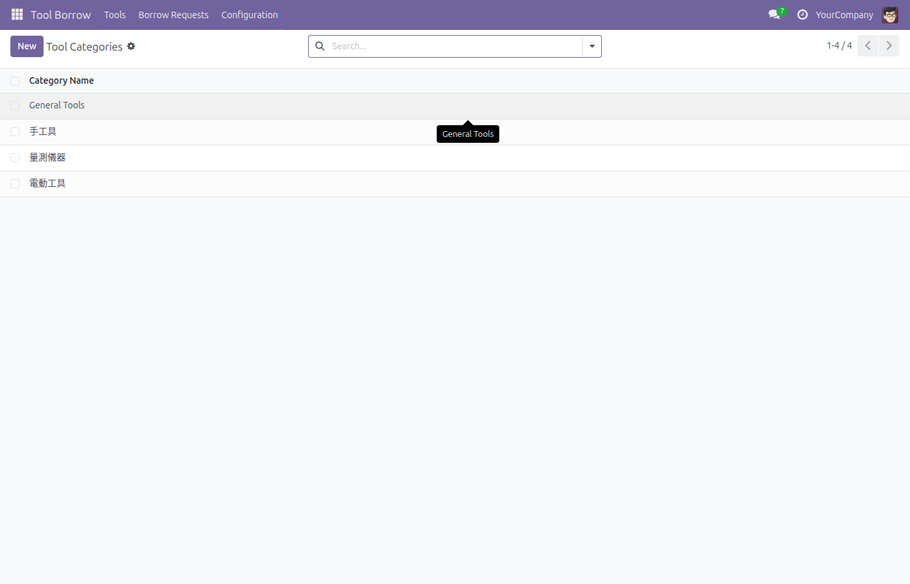

<p align="center">
  
</p>

<h1 align="center">Odoo 工具／設備借用管理</h1>

<p align="center">
  <strong>完整的 Odoo 18 工具與設備借用管理模組</strong><br/>
  審批工作流 · 入口網站自助服務 · 角色權限控管
</p>

<p align="center">
  <a href="#功能特色">功能特色</a> &bull;
  <a href="#系統架構">系統架構</a> &bull;
  <a href="#畫面截圖">畫面截圖</a> &bull;
  <a href="#安裝方式">安裝方式</a> &bull;
  <a href="#系統設定">系統設定</a> &bull;
  <a href="#使用方式">使用方式</a> &bull;
  <a href="#測試報告">測試報告</a> &bull;
  <a href="README.md">English</a>
</p>

<p align="center">
  
  
  
  
</p>

---

## 概述

**Tool Borrow** 是一個正式環境可用的 Odoo 18 模組，用於簡化組織內部工具與設備的借用管理。提供完整的借用生命週期與主管審批流程、品牌化的入口網站供使用者自助操作，以及細緻的存取權限控管——全面整合 Odoo 的郵件與通知系統。

<p align="center">
  
</p>

### 為什麼選擇這個模組？

| 痛點 | 解決方案 |
|------|----------|
| 不知道誰借了哪些工具 | 即時狀態追蹤，工具可用性自動更新 |
| 人工審批效率低且容易出錯 | 結構化工作流：草稿 → 待審核 → 已核准 → 已借出 → 已歸還 |
| 使用者無法自行操作 | 品牌化入口網站 `/my/tools`，支援瀏覽、申請及追蹤 |
| 權限控管不夠靈活 | 四級權限：無權限、使用者、主管、管理員 |
| 不同類別的工具有不同屬性 | 按類別設定動態屬性（如電壓、重量、校正日期） |
| 多對多欄位匯出格式混亂 | 逗號分隔匯出，方便匯入匯出循環 |

---

## 功能特色

### 工具管理

- **分類管理** — 依工具類型分組（電動工具、量測儀器、手工具等）
- **自動編碼** — 自動產生 `TL-001`、`TL-002`… 序號
- **狀態追蹤** — 可借用／已借出／維護中，狀態自動切換
- **動態屬性** — 依類別設定屬性模板，自動套用至該類別所有工具
- **授權使用者** — 控制哪些使用者可以查看並申請借用

### 借用審批流程

- **完整生命週期** — 草稿 → 待審核 → 已核准 → 已借出 → 已歸還（或駁回）
- **主管審批** — 借用申請需經主管核准方可放行
- **自動更新可用性** — 借出或歸還時自動更新工具狀態
- **重置支援** — 駁回或待審核的申請可重新設為草稿

### 入口網站自助服務

- **工具目錄** — 品牌化卡片式版面，顯示可用狀態與分類標籤
- **工具詳情** — 個別工具頁面含屬性與借用按鈕
- **借用紀錄** — 使用者可在 `/my/loans` 查看借用歷史與目前申請
- **借用申請** — 可直接從入口網站提交借用申請並附加備註

### 角色權限控管

- 透過設定頁面為每位使用者設定**四級權限**：

| 等級 | 權限說明 |
|------|----------|
| 無權限 | 無法查看或使用此模組 |
| 使用者 | 瀏覽工具、提交借用申請 |
| 主管 | 審核申請、確認借出與歸還 |
| 管理員 | 完整權限，包含系統設定與工具分類管理 |

---

## 系統架構

```
┌─────────────────────────────────────────────────────────────┐
│                  Tool Borrow 模組 (tool_borrow)              │
├─────────────────────────────────────────────────────────────┤
│                                                              │
│  ┌──────────────┐  ┌──────────────┐  ┌──────────────────┐   │
│  │  tool.tool    │  │  tool.loan   │  │  tool.category   │   │
│  │              │  │              │  │                  │   │
│  │ • 名稱/編碼  │  │ • 工作流     │  │ • 名稱           │   │
│  │ • 分類       │  │ • 審批       │  │ • 動態屬性       │   │
│  │ • 狀態       │  │ • 借用人     │  │ • 工具數量       │   │
│  │ • 動態屬性   │  │ • 日期       │  │                  │   │
│  │ • 授權使用者 │  │ • 備註       │  │                  │   │
│  └──────┬───────┘  └──────┬───────┘  └────────┬─────────┘   │
│         │                 │                    │             │
│         └────────┬────────┘────────────────────┘             │
│                  │                                           │
│  ┌───────────────▼──────────────────────────────────────┐   │
│  │              控制器 (Portal)                          │   │
│  │                                                       │   │
│  │  /my/tools ──── 工具目錄（卡片式排版）                  │   │
│  │  /my/tools/<id> ── 工具詳情 + 借用操作                  │   │
│  │  /my/loans ──── 借用紀錄                               │   │
│  │  /my/loans/<id> ── 借用詳情                             │   │
│  └───────────────────────────────────────────────────────┘   │
│                  │                                           │
│  ┌───────────────▼──────────────────────────────────────┐   │
│  │              安全層                                    │   │
│  │                                                       │   │
│  │  群組：基本使用者 │ 主管 │ 管理員                       │   │
│  │  記錄規則：依使用者控制工具可見性                        │   │
│  │  入口存取：透過 allowed_user_ids 控制                   │   │
│  └───────────────────────────────────────────────────────┘   │
│                                                              │
├──────────────────────────────────────────────────────────────┤
│                         Odoo 18 框架                         │
│           base │ mail │ portal                               │
└──────────────────────────────────────────────────────────────┘
```

### 模組結構

```
tool_borrow/
├── controllers/
│   └── portal.py              # 入口網站路由 (/my/tools, /my/loans)
├── data/
│   ├── tool_category_data.xml # 預設分類資料
│   └── tool_sequence_data.xml # 工具自動編碼 (TL-XXX)
├── i18n/
│   └── zh_TW.po               # 繁體中文翻譯
├── models/
│   ├── res_users.py           # 使用者存取等級擴充
│   ├── tool_loan.py           # 借用申請模型與工作流
│   └── tool_tool.py           # 工具/設備模型與分類
├── security/
│   ├── ir.model.access.csv    # 模型層級存取權限
│   └── tool_borrow_security.xml  # 群組與記錄規則
├── static/
│   ├── description/
│   │   ├── icon.png           # 模組圖示
│   │   ├── tool_form.png      # 後台截圖
│   │   └── category_list.png  # 後台截圖
│   └── src/css/
│       └── portal_brand.css   # 入口網站設計系統（Woowtech 品牌）
├── tests/
│   ├── test_round1_models.py      # 模型 CRUD 與工作流（30 項測試）
│   ├── test_round2_security.py    # 安全與存取控制（30 項測試）
│   ├── test_round3_http.py        # 入口網站 HTTP 端點（30 項測試）
│   ├── test_round4_browser.py     # 瀏覽器 UI 測試（34 項測試）
│   └── test_round5_supplementary.py  # 邊界案例與補充（30 項測試）
├── views/
│   ├── menu_views.xml         # 選單結構
│   ├── portal_templates.xml   # 入口網站模板（品牌化）
│   ├── res_users_views.xml    # 使用者表單擴充
│   ├── tool_loan_views.xml    # 借用清單/表單檢視
│   └── tool_tool_views.xml    # 工具清單/表單檢視
├── __init__.py
└── __manifest__.py
```

---

## 畫面截圖

### 後台 — 工具清單

一覽所有工具的狀態、分類、授權使用者及目前借用人。

<p align="center">
  
</p>

### 後台 — 工具表單

工具詳細資訊，包含動態屬性、授權使用者與借用歷史。

<p align="center">
  
</p>

### 後台 — 借用申請清單

追蹤所有借用申請的狀態、日期與審批流程。

<p align="center">
  
</p>

### 後台 — 借用申請表單

個別借用申請的審批按鈕與狀態追蹤。

<p align="center">
  
</p>

### 後台 — 工具分類

設定工具分類與動態屬性模板。

<p align="center">
  
</p>

### 後台 — 使用者權限設定

為每位使用者設定存取等級（無權限／使用者／主管／管理員）。

<p align="center">
  
</p>

### 入口網站 — 工具目錄

品牌化卡片版面，顯示可用狀態指示器與分類標籤。

<p align="center">
  
</p>

### 入口網站 — 工具詳情

個別工具頁面，包含屬性資訊與借用操作按鈕。

<p align="center">
  
</p>

### 入口網站 — 借用紀錄

使用者追蹤借用申請與目前借用狀態。

<p align="center">
  
</p>

### 入口網站 — 借用詳情

借用狀態詳細資訊與時間軸。

<p align="center">
  
</p>

---

## 安裝方式

### 系統需求

- **Odoo 18.0**（社群版或企業版）
- **Python 3.10+**
- 核心模組：`base`、`mail`、`portal`（Odoo 內建）

### 安裝步驟

1. 將 `tool_borrow` 資料夾複製到 Odoo 附加模組目錄：

   ```bash
   git clone https://github.com/WOOWTECH/Odoo_tool-device_borrow.git
   cp -r Odoo_tool-device_borrow/tool_borrow /path/to/odoo/addons/
   ```

2. 重新啟動 Odoo 或更新應用程式清單：

   **設定 → 技術 → 更新應用程式清單**

3. 安裝模組：

   **應用程式 → 搜尋「Tool Borrow」→ 安裝**

---

## 系統設定

### 1. 設定使用者權限

前往 **設定 → 使用者與公司 → 使用者**，選擇使用者，設定 **Tool Borrow Access** 欄位：

| 等級 | 權限說明 |
|------|----------|
| 無權限 | 無法查看或使用此模組 |
| 使用者 | 瀏覽工具、提交借用申請 |
| 主管 | 審核申請、確認借出與歸還 |
| 管理員 | 完整權限，包含系統設定 |

### 2. 建立工具分類

前往 **Tool Borrow → 設定 → 工具分類**。

分類可將工具分組，並定義動態屬性模板（如「電壓」、「重量」、「校正日期」），自動套用至該分類下所有工具。

### 3. 新增工具

前往 **Tool Borrow → 工具 → 新增**：

- **名稱** — 工具描述性名稱
- **編碼** — 自動產生 `TL-XXX`（保持「New」即可）
- **分類** — 決定可用的動態屬性
- **授權使用者** — 哪些使用者可以查看並申請此工具

---

## 使用方式

### 借用生命週期

```
草稿 ──► 待審核 ──► 已核准 ──► 已借出 ──► 已歸還
                 ↘ 駁回
```

駁回或待審核的申請可重新設為草稿。

### 使用者操作（入口網站）

1. 登入後前往 **`/my/tools`**
2. 瀏覽工具目錄，查看可用狀態
3. 點選工具查看詳情與屬性
4. 點選 **借用** 並填寫備註
5. 在 **`/my/loans`** 追蹤申請狀態

### 主管操作（後台）

1. 開啟 **Tool Borrow → 借用申請**
2. **核准** 或 **駁回** 待審核的申請
3. 工具交付時點選 **確認借出**
4. 工具歸還時點選 **確認歸還** — 工具狀態自動重設為「可借用」

---

## 測試報告

模組包含完整的測試套件，共 **154 項測試案例**，分為五個回合：

| 回合 | 測試重點 | 測試數 | 狀態 |
|------|----------|--------|------|
| 第一回合 | 模型 CRUD 與工作流 | 30 | ✅ 通過 |
| 第二回合 | 安全與存取控制 | 30 | ✅ 通過 |
| 第三回合 | 入口網站 HTTP 端點 | 30 | ✅ 通過 |
| 第四回合 | 瀏覽器 UI 測試 | 34 | ✅ 通過 |
| 第五回合 | 邊界案例與補充 | 30 | ✅ 通過 |
| **合計** | | **154** | **✅ 全數通過** |

### 執行測試

```bash
# 透過 XML-RPC 測試執行器執行所有測試
python3 tests/test_round1_models.py
python3 tests/test_round2_security.py
python3 tests/test_round3_http.py
python3 tests/test_round4_browser.py
python3 tests/test_round5_supplementary.py
```

---

## 授權條款

**LGPL-3** — GNU 較寬鬆公共授權條款第三版。

## 作者

**WoowTech** — [https://aiot.woowtech.io/](https://aiot.woowtech.io/)
